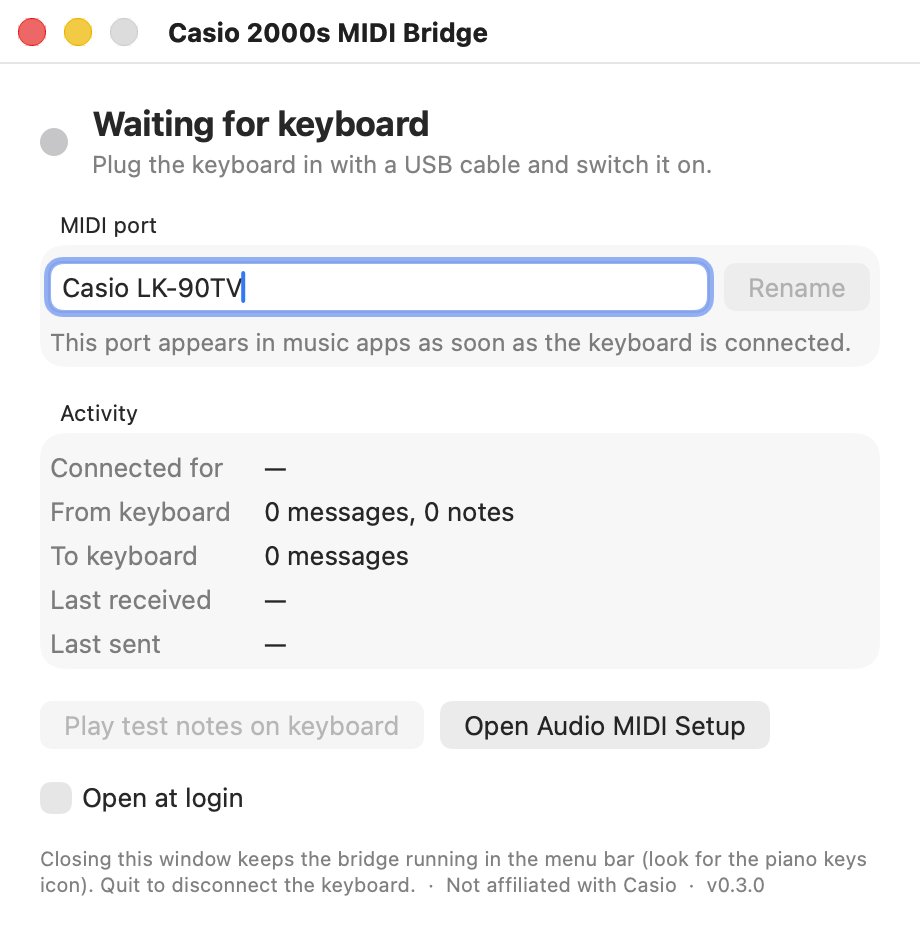

# casio-midi-bridge

[](https://github.com/command-paul/casio-midi-bridge/actions/workflows/ci.yml)
[](https://github.com/command-paul/casio-midi-bridge/releases/latest)
[](LICENSE)

Makes old Casio USB keyboards work as MIDI controllers on modern macOS.

Casio keyboards sold from roughly 2001 to 2010 (LK-90TV, LK-100, CTK-691, WK-3000,
PX-100, AP-series and many more) all share USB ID `07CF:6802` and are **not USB-MIDI
class compliant**. They plug in, they enumerate, and then nothing happens: no port in
Audio MIDI Setup, nothing in GarageBand or Logic. Casio's driver only ever supported
Mac OS X 10.2–10.4 on PowerPC.

`casio-midi-bridge` is a small user-space program that talks to the keyboard directly
over USB and exposes it as a normal CoreMIDI port. No kernel extension, no `sudo`, no
Apple entitlements.

Tested on macOS 26 (Apple silicon) with a Casio LK-90TV. Needs macOS 13 or later.

## The app (recommended)



**Casio MIDI Bridge.app** is a small window you open when you want to play. It shows
whether the keyboard is connected, the name of the MIDI port to pick in your music app,
live counters and the last message in each direction, a button that plays a few test notes
on the keyboard, and an "Open at login" switch. Close the window and it keeps running as a
piano-keys icon in the menu bar; quit it and the keyboard is disconnected again.

### Option 1: download the app (no building needed)

1. Get `Casio-MIDI-Bridge-<version>.zip` from the
   [latest release](https://github.com/command-paul/casio-midi-bridge/releases/latest).
2. Unzip it and drag **Casio MIDI Bridge** into your Applications folder.
3. First launch only: **right-click the app → Open → Open.** macOS shows a "cannot verify
   the developer" warning because the app is not notarized with a paid Apple Developer ID.
   After that one-time step it opens normally. (Equivalent from a terminal:
   `xattr -d com.apple.quarantine "/Applications/Casio MIDI Bridge.app"`.)

The app is self-contained: no installer, no extra files, nothing else gets modified.
Delete it from Applications to uninstall.

### Option 2: build from source

Needs Xcode Command Line Tools (`xcode-select --install`), nothing else. Building yourself
also sidesteps the Gatekeeper warning.

```bash
git clone https://github.com/command-paul/casio-midi-bridge.git
cd casio-midi-bridge
make install-app        # builds, copies to /Applications, opens it
```

`make uninstall-app` removes it.

### Using it

Plug in the keyboard, switch it on, and the port **"Casio USB MIDI"** appears (rename it in
the app if you like). In GarageBand, add a Software Instrument track and play; GarageBand
does not list input names, it just reports "1 MIDI input detected" under Settings →
Audio/MIDI. In Logic the port is listed under Settings → MIDI → Inputs. Audio MIDI Setup →
Window → Show MIDI Studio shows it too.

Both directions work: notes and controllers go in, and anything you send to the port
(a MIDI file, a DAW track) plays on the keyboard's own sounds.

## The headless service (advanced)

If you would rather have the bridge always on with no window, the same core is available
as a command-line tool plus a LaunchAgent:

```bash
make
make install                            # binary in ~/.local/bin, agent starts at login
make install PORT_NAME="Casio LK-90TV"  # custom port name
```

Only one program can own the keyboard at a time. If the service is running when you open
the app, the app says so and offers to stop it.

## Something not working?

See [docs/TROUBLESHOOTING.md](docs/TROUBLESHOOTING.md): keyboard not detected, "in use by
another program", GarageBand's "2 MIDI inputs detected", doubled notes, Gatekeeper
warnings, latency, and where the logs are.

## Manage the service

```bash
make status      # is the agent running? last log lines
make log         # follow the log
make restart     # after rebuilding
make uninstall   # remove agent and binary
```

Run it by hand to watch packets go by (stop the agent first, only one process can own
the USB interface):

```bash
./build/casio-midi-bridge -v
```

## Tools

* `build/midimon [port name]` prints decoded MIDI as it arrives from the virtual port.
  (Build the tools with `make`.)
* `build/usbdesc [vid [pid]]` dumps USB descriptors of attached Casio devices, for adding
  new models (see [CONTRIBUTING.md](CONTRIBUTING.md)).

## How it works

The keyboard's only USB interface is declared as *vendor specific* (class `0xFF`), so
macOS never attaches its built-in USB-MIDI driver. Underneath, the interface carries
ordinary USB-MIDI Streaming descriptors, one bulk OUT endpoint and one interrupt IN
endpoint, and the data on the wire is standard USB-MIDI 1.0 four-byte event packets.
Linux has handled this ID for years with a one-line quirk (`QUIRK_MIDI_YAMAHA` in
`sound/usb/quirks-table.h`).

The core (`src/bridge.c`, shared by the app and the CLI):

1. Registers IOKit matching notifications for the known USB IDs, so it reacts to
   plug/unplug without polling.
2. On attach, opens the device with `IOUSBLib`, selects configuration 1, claims interface
   0 and finds the IN/OUT endpoints.
3. Creates a virtual CoreMIDI source and destination with stable unique IDs, so DAWs
   remember the port across reconnects.
4. Streams IN packets to the source and encodes destination traffic into OUT packets.
   The codec (`src/usbmidi.h`) handles SysEx of any length, running status and realtime
   bytes, and is covered by unit tests (`make test`).
5. If another process already owns the keyboard it does not fight for it; it reports
   "in use" and retries every few seconds.

The app (`app/`) is a single SwiftUI file on top of that C API; the CLI (`src/cli.c`) is
a few dozen lines. Everything builds with `clang`/`swiftc` from Command Line Tools, no
Xcode project.

## Supported hardware

| USB ID | Devices |
|---|---|
| `07CF:6802` | Most 2001–2010 Casio USB keyboards and digital pianos |
| `07CF:6801` | Casio PL-40R |

Any other device with the same descriptor shape can be tried with
`--vid 0xVVVV --pid 0xPPPP`. Please open a PR to add IDs that work.

## Alternatives

* [francoisferland/casiousbmididriver](https://github.com/francoisferland/casiousbmididriver):
  a CoreMIDI plugin driver derived from Apple's old sample USB MIDI driver. It makes the
  keyboard appear as a real device rather than a virtual port, but needs full Xcode to build
  and a signed build to load on current macOS.
* Apple's MIDIDriverKit (macOS 14+) is the sanctioned way to ship a real driver. It needs a
  paid developer account and a USB transport entitlement granted by Apple.

## References and prior art

No code in this repository is copied from any of these; they were used to identify the
device and confirm the wire format.

* Linux `snd-usb-audio` quirk table, entry for `07cf:6802` "Casio Keyboard"
  (`QUIRK_MIDI_YAMAHA`), which established that the data is standard USB-MIDI packets:
  <https://github.com/torvalds/linux/blob/master/sound/usb/quirks-table.h>
* USB Implementers Forum, *Universal Serial Bus Device Class Definition for MIDI Devices*
  1.0 (1999), the packet format in `src/usbmidi.h`: <https://www.usb.org/document-library/usb-midi-devices-10>
* francoisferland/casiousbmididriver, the earlier CoreMIDI plugin approach, and its issue
  about the LK-90TV: <https://github.com/francoisferland/casiousbmididriver>,
  <https://github.com/francoisferland/casiousbmididriver/issues/28>
* Apple Community thread on Casio USB-MIDI drivers:
  <https://discussions.apple.com/thread/1198971>
* Casio's own (discontinued) USB MIDI driver page:
  <https://support.casio.com/en/support/osdevicePage.php?cid=008002001>
* Apple documentation for IOUSBLib (`IOUSBDeviceInterface`, `IOUSBInterfaceInterface`) and
  CoreMIDI virtual endpoints (`MIDISourceCreate`, `MIDIDestinationCreate`).

## Privacy and safety

The bridge runs entirely in user space with no administrator rights. It opens only USB
devices whose vendor/product IDs are on its list, makes no network connections, and stores
nothing except the port name in the app's own preferences. See [SECURITY.md](SECURITY.md)
for how to report a problem.

## Acknowledgements

* The ALSA developers, whose one-line quirk for this USB ID documented the wire format.
* [François Ferland](https://github.com/francoisferland/casiousbmididriver) for the earlier
  CoreMIDI plugin driver that kept these keyboards usable for years.
* The code was written with the help of Claude (Anthropic), which is noted in the commit
  trailers.

## License

MIT. See [LICENSE](LICENSE).
